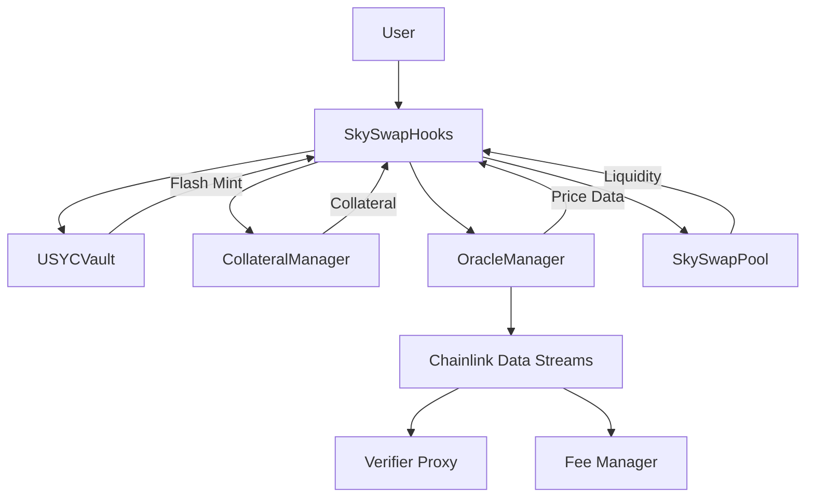

# SkySwap Protocol


SkySwap is an advanced decentralized finance (DeFi) protocol built on Uniswap V4 hooks, featuring single-sided liquidity provision, collateralized debt positions, and USYC (USD Yield Coin) flash minting capabilities.

## 🚀 Features

### Core Functionality
- **Single-Sided Liquidity**: Add liquidity with only one token using flash loans
- **USYC Flash Minting**: Instant liquidity through flash loan mechanisms
- **Collateralized Debt Positions (CDPs)**: Borrow USYC against LP token collateral
- **Dynamic Oracle Integration**: Real-time price feeds via Chainlink Data Streams
- **Automated Liquidations**: Risk management through automated position liquidation

### Advanced Features
- **Peg Band Monitoring**: Automatic price deviation detection and response
- **Multi-Asset Support**: Support for various ERC-20 tokens as collateral
- **Yield Optimization**: Maximize returns through intelligent liquidity strategies
- **Risk Management**: Comprehensive LTV (Loan-to-Value) ratio monitoring

## 🏗️ Architecture



### Contract Overview

| Contract | Description |
|----------|-------------|
| `SkySwapHooks` | Main hook contract implementing Uniswap V4 lifecycle hooks |
| `USYCVault` | ERC-20 compliant vault for USYC token management and flash loans |
| `CollateralManager` | Manages user collateral positions and liquidation logic |
| `OracleManager` | Chainlink Data Streams integration for price feeds |
| `SkySwapFactory` | Factory contract for creating new pool instances |
| `SkySwapPool` | Custom AMM pool with oracle integration |

## 📋 Prerequisites

- **Node.js** >= 16.0.0
- **Foundry** (latest version)
- **Git**

## 🛠️ Installation

1. **Clone the repository**
```bash
git clone https://github.com/your-org/SkySwap.git
cd SkySwap
```

2. **Install dependencies**
```bash
forge install
```

## 🚀 Quick Start

### Build
```bash
forge build
```

### Test
```bash
# Run all tests
forge test

# Run with verbosity
forge test -vvv

# Run specific test
forge test --match-test testSingleSidedLiquidity -vvv
```

### Deploy

1. **Deploy to Unichain Sepolia Testnet**
```bash
forge script script/00_DeployHook.s.sol --rpc-url $RPC_URL --broadcast --verify
```

2. **Create Pool and Add Initial Liquidity**
```bash
forge script script/01_CreatePoolAndAddLiquidity.s.sol --rpc-url $RPC_URL --broadcast
```

## 💡 Usage Examples

### Single-Sided Liquidity Addition

```solidity
// User wants to add liquidity with only Token A
// The hook will:
// 1. Flash mint USYC equal to token value
// 2. Use USYC to acquire Token B from the pool
// 3. Add both tokens as liquidity
// 4. Repay flash loan using LP tokens as collateral

```

### USYC Flash Minting

```solidity
// Flash mint USYC for arbitrage or other strategies
uint256 flashAmount = 10000e18;
usycVault.flashMint(recipient, flashAmount);
// Recipient must implement flash loan callback
// and repay the loan within the same transaction
```

### Collateral Management

```solidity
// Deposit LP tokens as collateral
collateralManager.depositCollateral(user, lpAmount);

// Borrow USYC against collateral (up to 75% LTV)
uint256 borrowAmount = 750e18; // For 1000e18 collateral
usycVault.mint(user, borrowAmount);

// Check liquidation status
bool isLiquidatable = collateralManager.isLiquidatable(user);
```

## 🔧 Configuration

### Oracle Setup
Configure Chainlink Data Streams for price feeds:

```solidity
// Configure data stream for a token
DataStreamConfig memory config = DataStreamConfig({
    feedId: 0x..., // Chainlink feed ID
    verifier: 0x..., // Verifier proxy address
    isActive: true
});

oracleManager.configureDataStream(tokenAddress, config);
```

## 🧪 Testing

The protocol includes comprehensive tests covering:

- **Unit Tests**: Individual contract functionality
- **Integration Tests**: Cross-contract interactions
- **Oracle Tests**: Data stream integration with mocks
- **Edge Cases**: Error conditions and boundary testing

### Test Coverage
```bash
forge coverage
```

### Invariant Testing
```bash
forge test --match-test invariant
```

## 🔒 Security

### Audits
- [ ] Initial security review
- [ ] Formal audit (planned)
- [ ] Bug bounty program (planned)

### Security Features
- **Reentrancy Protection**: All external calls protected
- **Access Controls**: Role-based permissions
- **Oracle Validation**: Multiple price feed verification
- **Emergency Pause**: Circuit breaker functionality

## 🤝 Contributing

We welcome contributions! Please see our [Contributing Guidelines](CONTRIBUTING.md) for details.

1. Fork the repository
2. Create a feature branch
3. Make your changes
4. Add tests
5. Submit a pull request

## 📝 License

This project is licensed under the MIT License - see the [LICENSE](LICENSE) file for details.

## 🔗 Links

- **Documentation**: [deepwiki.com/SkyYap/SkySwap](https://deepwiki.com/SkyYap/SkySwap)
- **Discord**: [Join our community](https://discord.gg/skyswap)
- **Twitter**: [@SkySwapProtocol](https://twitter.com/SkySwapProtocol)
- **Medium**: [SkySwap Blog](https://medium.com/@skyswap)

## ⚠️ Disclaimer

This software is experimental and unaudited. Use at your own risk. The developers are not responsible for any loss of funds or other damages that may result from using this software.

## 🙏 Acknowledgments

- **Uniswap Labs** for the V4 hooks framework
- **Chainlink** for Data Streams oracle infrastructure
- **OpenZeppelin** for security libraries
- **Foundry** for development tooling

---

*Built with ❤️ by the SkySwap team*

```bash
git remote add template https://github.com/uniswapfoundation/v4-template
git fetch template
git merge template/main <BRANCH> --allow-unrelated-histories
```

</details>

### Requirements

This template is designed to work with Foundry (stable). If you are using Foundry Nightly, you may encounter compatibility issues. You can update your Foundry installation to the latest stable version by running:

```
foundryup
```

To set up the project, run the following commands in your terminal to install dependencies and run the tests:

```
forge install
forge test
```

### Local Development

Other than writing unit tests (recommended!), you can only deploy & test hooks on [anvil](https://book.getfoundry.sh/anvil/) locally. Scripts are available in the `script/` directory, which can be used to deploy hooks, create pools, provide liquidity and swap tokens. The scripts support both local `anvil` environment as well as running them directly on a production network.

### Troubleshooting

<details>

#### Permission Denied

When installing dependencies with `forge install`, Github may throw a `Permission Denied` error

Typically caused by missing Github SSH keys, and can be resolved by following the steps [here](https://docs.github.com/en/github/authenticating-to-github/connecting-to-github-with-ssh)

Or [adding the keys to your ssh-agent](https://docs.github.com/en/authentication/connecting-to-github-with-ssh/generating-a-new-ssh-key-and-adding-it-to-the-ssh-agent#adding-your-ssh-key-to-the-ssh-agent), if you have already uploaded SSH keys

#### Anvil fork test failures

Some versions of Foundry may limit contract code size to ~25kb, which could prevent local tests to fail. You can resolve this by setting the `code-size-limit` flag

```
anvil --code-size-limit 40000
```

#### Hook deployment failures

Hook deployment failures are caused by incorrect flags or incorrect salt mining

1. Verify the flags are in agreement:
   - `getHookCalls()` returns the correct flags
   - `flags` provided to `HookMiner.find(...)`
2. Verify salt mining is correct:
   - In **forge test**: the _deployer_ for: `new Hook{salt: salt}(...)` and `HookMiner.find(deployer, ...)` are the same. This will be `address(this)`. If using `vm.prank`, the deployer will be the pranking address
   - In **forge script**: the deployer must be the CREATE2 Proxy: `0x4e59b44847b379578588920cA78FbF26c0B4956C`
     - If anvil does not have the CREATE2 deployer, your foundry may be out of date. You can update it with `foundryup`

</details>

### Additional Resources

- [Uniswap v4 docs](https://docs.uniswap.org/contracts/v4/overview)
- [v4-periphery](https://github.com/uniswap/v4-periphery)
- [v4-core](https://github.com/uniswap/v4-core)
- [v4-by-example](https://v4-by-example.org)
