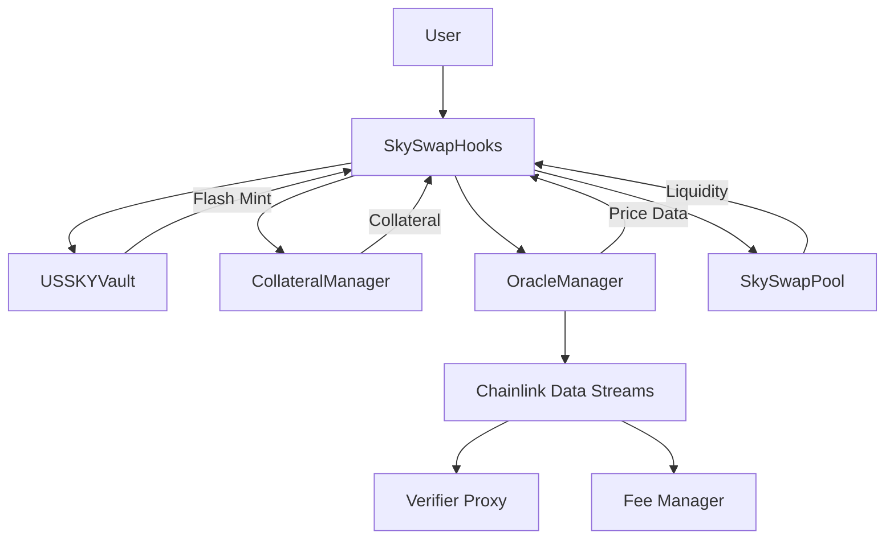

# SkySwap Protocol


SkySwap is an advanced decentralized finance (DeFi) protocol built on Uniswap V4 hooks, featuring single-sided liquidity provision, collateralized debt positions, and USSKY (wrapped of USD Yield-Bearing Coin) flash minting capabilities.

## 📄 Whitepaper

[Read the SkySwap Whitepaper](https://docs.google.com/document/d/1Zi5tqRVyf7uHWlxWrPH1v5NAi-EERH8zuMdJ9Fn5wZM/edit?usp=sharing)

## 🚀 Features

### Core Functionality
- **Single-Sided Liquidity**: Add liquidity with only one token using flash loans
- **USSKY Flash Minting**: Instant liquidity through flash loan mechanisms
- **Collateralized Debt Positions (CDPs)**: Borrow USSKY against LP token collateral
- **Dynamic Oracle Integration**: Real-time price feeds via Chainlink Data Streams
- **Use of USSKY**: Additional yield stream to LP provider

## 🏗️ Architecture



### Contract Overview

| Contract | Description |
|----------|-------------|
| `SkySwapHooks` | Main hook contract implementing Uniswap V4 lifecycle hooks |
| `USSKYVault` | ERC-20 compliant vault for USYC token management and flash loans |
| `CollateralManager` | Manages user collateral positions and liquidation logic |
| `OracleManager` | Chainlink Data Streams integration for price feeds |
| `SkySwapFactory` | Factory contract for creating new pool instances |
| `SkySwapPool` | Custom AMM pool with oracle integration |

## 📋 Prerequisites

- **Node.js** >= 16.0.0
- **Foundry** (latest version)
- **Git**

## 🛠️ Installation

1. **Clone the repository**
```bash
git clone https://github.com/your-org/SkySwap.git
cd SkySwap
```

2. **Install dependencies**
```bash
forge install
```

## 🚀 Quick Start

### Build
```bash
forge build
```

### Test
```bash
# Run all tests
forge test

# Run with verbosity
forge test -vvv

# Run specific test
forge test --match-test testSingleSidedLiquidity -vvv
```

### Deploy

1. **Deploy to Unichain Sepolia Testnet**
```bash
forge script script/00_DeployHook.s.sol --rpc-url $RPC_URL --broadcast --verify
```

2. **Create Pool and Add Initial Liquidity**
```bash
forge script script/01_CreatePoolAndAddLiquidity.s.sol --rpc-url $RPC_URL --broadcast
```

## 💡 Usage Examples

### Single-Sided Liquidity Addition

```solidity
// User wants to add liquidity with only Token A
// The hook will:
// 1. Flash mint USSKY equal to token value
// 2. Use USSKY to acquire Token B from the pool
// 3. Add both tokens as liquidity
// 4. Repay flash loan using LP tokens as collateral

```

### USSKY Flash Minting

```solidity
// Flash mint USSKY for arbitrage or other strategies
uint256 flashAmount = 10000e18;
usskyVault.flashMint(recipient, flashAmount);
// Recipient must implement flash loan callback
// and repay the loan within the same transaction
```

### Collateral Management

```solidity
// Deposit LP tokens as collateral
collateralManager.depositCollateral(user, lpAmount);

// Borrow USSKY against collateral (up to 75% LTV)
uint256 borrowAmount = 750e18; // For 1000e18 collateral
usskyVault.mint(user, borrowAmount);

// Check liquidation status
bool isLiquidatable = collateralManager.isLiquidatable(user);
```

## 🔧 Configuration

### Oracle Setup
Configure Chainlink Data Streams for price feeds:

```solidity
// Configure data stream for a token
DataStreamConfig memory config = DataStreamConfig({
    feedId: 0x..., // Chainlink feed ID
    verifier: 0x..., // Verifier proxy address
    isActive: true
});

oracleManager.configureDataStream(tokenAddress, config);
```

## 🧪 Testing

The protocol includes comprehensive tests covering:

- **Unit Tests**: Individual contract functionality
- **Integration Tests**: Cross-contract interactions
- **Oracle Tests**: Data stream integration with mocks
- **Edge Cases**: Error conditions and boundary testing

### Test Coverage
```bash
forge coverage
```

### Invariant Testing
```bash
forge test --match-test invariant
```

## 🔒 Security

### Audits
- [ ] Initial security review
- [ ] Formal audit (planned)
- [ ] Bug bounty program (planned)

### Security Features
- **Reentrancy Protection**: All external calls protected
- **Access Controls**: Role-based permissions
- **Oracle Validation**: Multiple price feed verification
- **Emergency Pause**: Circuit breaker functionality

## 🤝 Contributing

We welcome contributions! Please see our [Contributing Guidelines](CONTRIBUTING.md) for details.

1. Fork the repository
2. Create a feature branch
3. Make your changes
4. Add tests
5. Submit a pull request

## 📝 License

This project is licensed under the MIT License - see the [LICENSE](LICENSE) file for details.

## ⚠️ Disclaimer

This software is experimental and unaudited. Use at your own risk. The developers are not responsible for any loss of funds or other damages that may result from using this software.

## 🙏 Acknowledgments

- **Uniswap Labs** for the V4 hooks framework
- **Chainlink** for Data Streams oracle infrastructure
- **OpenZeppelin** for security libraries
- **Foundry** for development tooling

---

*Built with ❤️ by the SkySwap team*